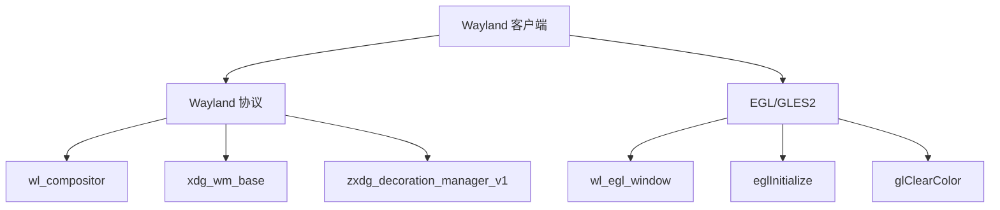

# Wayland Client GLES Demo 架构文档

## 项目概述
本项目是一个基于 Wayland 协议的客户端演示程序，使用 `wl_egl_window`、EGL 和 GLES2 在 Wayland 上创建一个顶层窗口，并渲染简单的动态清屏色。

## 技术栈
- **Wayland 协议**：用于与 Wayland 合成器通信，创建窗口和管理输入输出。
- **EGL**：用于管理 OpenGL ES 上下文和窗口表面。
- **GLES2**：用于渲染动态清屏色。
- **CMake**：用于构建项目。

## 核心组件

### 1. Wayland 客户端初始化
- **`wl_display_connect`**：连接到 Wayland 显示服务器。
- **`wl_registry`**：注册全局对象（如 `wl_compositor` 和 `xdg_wm_base`）。
- **`wl_surface`**：创建 Wayland 表面，用于绘制内容。

### 2. XDG Shell 协议
- **`xdg_wm_base`**：用于创建和管理顶层窗口。
- **`xdg_surface`** 和 **`xdg_toplevel`**：定义窗口的行为和外观。

### 3. XDG Decoration 协议
- **`zxdg_decoration_manager_v1`**：请求服务器端装饰（如标题栏和边框）。

### 4. EGL 和 GLES2 集成
- **`wl_egl_window`**：将 Wayland 表面与 EGL 窗口关联。
- **`eglInitialize`** 和 **`eglCreateContext`**：初始化 EGL 并创建 OpenGL ES 上下文。
- **`glClearColor` 和 `glClear`**：渲染动态清屏色。

## 构建与运行
1. **构建**：
   ```bash
   mkdir build && cd build
   cmake ..
   make
   ```
2. **运行**：
   ```bash
   ./wayland_client_gles_demo
   ```

## 参考资源
- [Wayland 教程](https://wayland-book.com/)
- [Weston 示例](https://cgit.freedesktop.org/wayland/weston/tree/clients/)
- [Wayland 客户端演示](https://github.com/ds-hwang/wayland_client_demo)

## 架构图


## 总结
本项目展示了如何在 Wayland 环境下使用 EGL 和 GLES2 创建一个简单的图形应用程序。通过 Wayland 协议和 XDG Shell 扩展，实现了窗口管理和渲染功能。